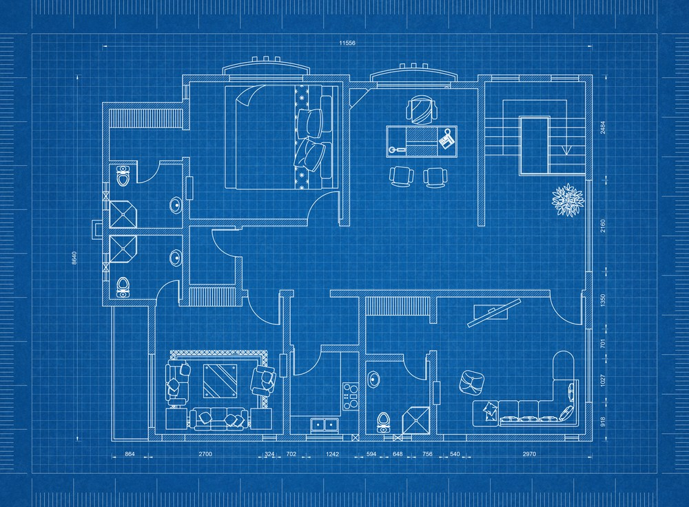
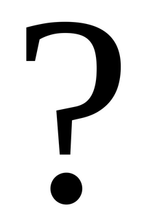

# Kas yra klasė?

Klasę galite įsivaizduoti kaip brėžinį, planą, šabloną.

## Apie klasę

- Kuriant klasę, jūs apibrėžiate šabloną naujam duomenų tipui. Tokiu būdu apibūdinate iš ko bus sudarytas jūsų naujai sukurtas duomenų tipas.
- Klasėje nėra realių duomenų, nes klasė yra tik šablonas pagal kurį bus galima surašyti duomenis.
- Klasė apibūdins kokie duomenys bus priskiriami objektams, bei kokius veiksmus bus galima atlikti su objektais.
- Klasę galima įsivaizduoti kaip kažką kas gali apibūdinti visų to paties tipo objektų bendrus atributus, t. y. kažką ką galima pasakyti apie kiekvieną tam tikro tipo objektą. Pavyzdžiui: visų automobilių bendri atributai - markė, modelis, metai, rida, spalva...

## Pavyzdžiai

Šiek tiek klasių pavyzdžių.

### Automobilis

Kokie bendri atributai sieja kiekvieną automobilį?

- Markė.
- Modelis.
- Pagaminimo metai.
- Rida.
- Darbinis tūris.
- …

Kokius veiksmus gali kiekvienas automobilis:

- Užsikurti.
- Važiuoti.
- ...

### Žmogus

Kokie bendri atributai sieja kiekvieną žmogų?
- Vardas.
- Pavardė.
- Amžius.
- Ūgis.
- Lytis.
- Profesija.
- …

Kokius veiksmus gali atlikti kiekvienas žmogus?
- Eiti į darbą.
- Valgyti.
- Vaikščioti
- ...

### Medis

Bendri kiekvieno medžio atributai:
- Pavadinimas.
- Aukštis.
- Amžius.
- Rūšis.
- …

Medžių galimi atlikti veiksmai:
- Numesti lapus.
- ...

### Prekė

Kiekvienos prekės bendri atributai:
- Pavadinimas.
- Kaina.
- Savikaina.
- Brūkšninis kodas.
- Kiekis.
- …

### Jūsų pavyzdys

Jūsų eilė: sugalvokite dar bent po vieną klasės pavyzdį, apibūdinant kokie atributai sieja kiekvieną iš tų objektų, bei kokius veiksmus jie gali atlikti.

## Kas sudaro klasę?

Iš pavyzdžių tikriausiai jau supratote kas įeina į kiekvieną klasę:

- **Duomenys (kintamieji)** - tai kažkokie bendri objektų atributai, duomenys. Jie yra užrašomi kintamųjų pavidalu.
- **Algoritmai (funkcijos / metodai)** - tai veiksmai ką galima atlikti su šiais bendrais atributais, duomenimis, ar apskritai kokius veiksmus šis objektas gali atlikti, kaip jis siejasi su išoriniu pasauliu.
