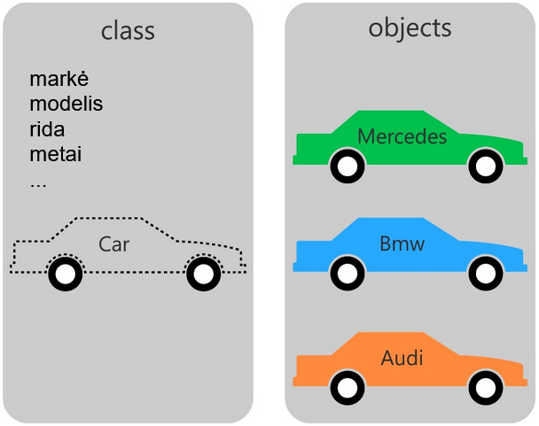
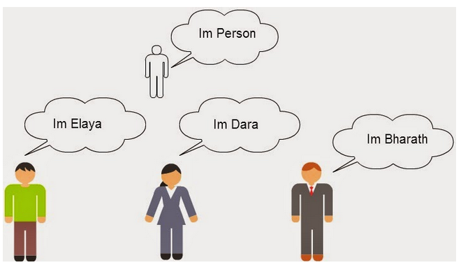

# Kas yra objektas?

Čia susipažinsite su objekto sąvoka.

## Apie objektus

- Objektas - tai kažkas kas jau turi realius duomenis, kuriuos numatė klasė.
- Objektas tai tarsi kintamasis, kuriame yra sudėti kiti kintamieji, galintys plačiau apibūdinti tam tikrą dalyką.
- Objektai gali atlikti kokius nors veiksmus.
- Viena klasė gali turėti daug objektų.
- Objektai remiasi tos pačios klasės šablonu, tačiau kiekvienas objektas yra unikalus.
- Viskas ką turi objektas prieinama per rodyklę, t. y. rašant objekto pavadinimą, tuomet rodyklę ir galiausiai norimą pasiekti objekte dalyką (kintamąjį ar metodą).

## Pavyzdžiai

Šiek tiek klasių ir objektų pavyzdžių.

### Automobiliai



Tarkime turi klasę, kurioje apibrėžėme šiuos duomenis (bendrus automobilių atributus):

- Markė.
- Modelis.
- Rida.
- Metai.

Tuomet galima turėti kelis skirtingus objektus, kuriuose nurodyti duomenys jau turės reikšmes.

Pavyzdžiui, pirmas objektas:

- Markė = mercedes
- Modelis = benz
- Rida = 250000
- Metai = 2001

Pavyzdžiui, antras objektas:

- Markė = bmw
- Modelis = 320
- Rida = 2154
- Metai = 2015

Pavyzdžiui, trečias objektas:

- Markė = audi
- Modelis = 80
- Rida = 324847
- Metai = 1999

### Žmonės



Tarkime turime klasę, kurioje nurodyti šie duomenys (bendri žmones siejantys atributai):

- Vardas.
- Pavardė.
- Amžius.

Tuomet galime kurti daug įvairių, su jau konkrečiais duomenimis, objektų.

Pavyzdžiui, pirmas objektas:

- Vardas = Jonas
- Pavardė = Jonaitis
- Amžius = 54

Pavyzdžiui, antras objektas:

- Vardas = Petras
- Pavardė = Petraitis
- Amžius = 73

## Sintaksė

Objektą sukurti galime su tokia sintakse:

```php
<?php

$objektoPavadinimas = new KlasesPavadinimas(<argumentai>);

?>
```

## Objekto panaudojimo sintaksė

```php
<?php

$objektoPavadinimas->Kintamasis; // tik public kintamiesiems
$objektoPavadinimas->Metodas(); // tik public metodams

?>
```
